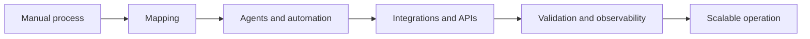

<!-- section:language -->
[Português](./README.md) | English

<!-- section:header -->
# Alemão Dev

## Head of Technology and Automation @ WZ Soluções

I specialize in AI, agents, integrations, and automation that transforms manual processes into scalable systems.

<!-- section:about -->
## About me

At WZ Soluções, I lead technology solutions that connect customer service, sales, and service delivery. I build integrations, automate lead and WhatsApp workflows, and work in an *agent-first* operation where AI agents support analysis, development, testing, documentation, and maintenance.

I focus on understanding the process before choosing the tool, combining product engineering, automation, and applied AI with human validation and clear quality standards.

<!-- section:capabilities -->
## Capabilities and focus

<!-- capability:applied-ai -->
- **AI agents and applied AI:** agents embedded in real workflows with context, tools, and validation.
<!-- capability:process-automation -->
- **Process automation:** turning fragmented manual routines into repeatable pipelines.
<!-- capability:integrations-apis -->
- **Integrations and APIs:** connecting products, data, webhooks, and services through clear contracts.
<!-- capability:product-engineering -->
- **Product engineering:** end-to-end delivery, from discovery through operation and evolution.
<!-- capability:agent-assisted-operations -->
- **Agent-assisted operations:** agents support analysis, development, testing, documentation, and maintenance under human supervision.

<!-- section:method -->
## How I work

The method starts with the process, applies agents, automation, and integrations where they create value, and adds validation and observability before scaling the operation. Not every solution needs every component in the stack.

<!-- section:stack -->
## Technology stack

### AI, agents, and knowledge

### Automation, data, and browser workflows

### Engineering

### Data, infrastructure, and delivery

<!-- section:cases -->
## Selected case studies

<!-- case:autoposter -->
### Autoposter

- **Problem/context:** an Instagram content operation spread across separate steps.
- **Solution:** a pipeline combining scraping, trend analysis, AI-assisted generation, rendering, and publishing.
- **Capabilities demonstrated:** automation orchestration, source integration, generative AI, and media pipelines.
- **Impact:** a centralized editorial workflow with less manual work.
- **Availability:** Private project — sanitized overview.

<!-- case:viralizer -->
### Viralizer

- **Problem/context:** preparing visual content for multilingual operations and editorial approval.
- **Solution:** a micro-SaaS with scraping, AI-assisted image and caption translation, variants, and Kanban approval.
- **Capabilities demonstrated:** human-in-the-loop workflow, multimodal transformation, state traceability, and preparation for automated publishing.
- **Impact:** a traceable multilingual operation prepared for automated publishing.
- **Availability:** Private project — sanitized overview.

<!-- case:rag-consultant -->
### RAG Consultant Agent

- **Problem/context:** technical queries across PDF document collections.
- **Solution:** PDF ingestion, embeddings, vector search, cited sources, filters, and retrieval benchmarks.
- **Capabilities demonstrated:** RAG, pgvector, source traceability, and retrieval evaluation.
- **Impact:** faster, source-grounded technical queries.
- **Availability:** Private project — sanitized overview.

<!-- case:finance-manager -->
### Automated Finance Manager

- **Problem/context:** integrated management of accounts, cards, and recurring financial commitments.
- **Solution:** a system for income, expenses, subscriptions, installments, reports, and simulations, connected through webhooks and n8n.
- **Capabilities demonstrated:** financial modeling, event-driven automation, reports, and simulations with Next.js, TypeScript, Supabase/PostgreSQL, and Docker.
- **Impact:** centralized financial tracking and automated related operational workflows.
- **Availability:** Private project — sanitized overview.

<!-- section:analytics -->
## Analytics and contributions

Languages represent the distribution of code detected in the analyzed repositories; they are not a measure of proficiency.

<!-- section:cta -->
## Let's build smarter systems

### [Explore my work](https://alemaodev.com/)

You can also find me on [LinkedIn](https://www.linkedin.com/in/yurisinn/) and [Instagram](https://www.instagram.com/alemaodev).

<!-- section:footer -->
PT-BR · EN-US · UTC-3
